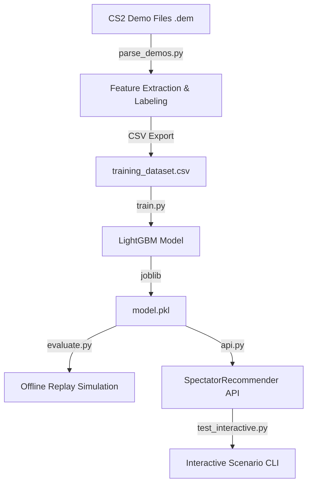

# CS2 Auto-Spectator Recommendation System

A machine learning pipeline and API designed to predict player engagement in Counter-Strike 2 (CS2) match demos. The system automatically recommends the most "exciting" or action-bound player to spectate in real-time, matching or exceeding the capabilities of human observers by anticipating combat events before they happen.

---

## Overview

The **CS2 Auto-Spectator** parses CS2 demo files (`.dem`), extracts spatial-temporal player features, trains a LightGBM regressor to predict a future combat/excitement score, and provides a real-time recommendation API.



---

## Project Structure

- [main.py](file:///d:/Projects/major%20projects/auto_spectate/main.py): Main entry point orchestrating parsing, training, offline evaluation, and a sample API prediction.
- [src/auto_spectate/parse_demos.py](file:///d:/Projects/major%20projects/auto_spectate/src/auto_spectate/parse_demos.py): Extracts player features and computes future combat scores from raw CS2 `.dem` files.
- [src/auto_spectate/train.py](file:///d:/Projects/major%20projects/auto_spectate/src/auto_spectate/train.py): Trains a `LGBMRegressor` and evaluates basic regression metrics on a test split (split by demo file to prevent data leakage).
- [src/auto_spectate/evaluate.py](file:///d:/Projects/major%20projects/auto_spectate/src/auto_spectate/evaluate.py): Simulates an offline spectator replay using a test demo to measure observer-specific performance metrics (Kill Coverage, Combat Coverage, Lead Time).
- [src/auto_spectate/api.py](file:///d:/Projects/major%20projects/auto_spectate/src/auto_spectate/api.py): Provides the core `SpectatorRecommender` class for real-time predictions.
- [test_interactive.py](file:///d:/Projects/major%20projects/auto_spectate/test_interactive.py): Interactive CLI tool containing pre-configured scenarios (e.g., AWP sniper holding angle vs entry fragger rushing, low health escape vs active trade) to test the recommendation engine interactively.
- [pyproject.toml](file:///d:/Projects/major%20projects/auto_spectate/pyproject.toml): Project dependencies and build setup managed via `uv`.

---

## Features & Target Scoring

### Player Features Extracted (16 Dimensions)
The pipeline extracts temporal, spatial, and tactical features for every alive player at a 1-second interval (every 64 ticks at 64Hz):
1. `hp`: Current health of the player (0 - 100).
2. `armor`: Current armor of the player (0 - 100).
3. `weapon_tier`: Categorized tier of the active weapon:
   - **Tier 4 (Snipers)**: AWP, SCAR-20, G3SG1.
   - **Tier 3 (Rifles)**: AK-47, M4A4, M4A1-S, Galil, FAMAS, SG 553, AUG, SSG 08.
   - **Tier 2 (SMGs/Heavy)**: Mac-10, MP9, MP7, MP5, UMP, P90, Bizon, MAG-7, XM1014, Nova, Sawed-Off, Negev, M249.
   - **Tier 1 (Pistols / Default)**: USP-S, Glock-18, P250, Five-SeveN, Tec-9, Desert Eagle, Dual Berettas, CZ75-Auto, R8 Revolver, P2000.
4. `speed`: Horizontal movement speed (units/second).
5. `nearest_enemy_distance`: Distance to the nearest alive opponent.
6. `enemy_count_500`: Number of alive enemies within 500 game units.
7. `enemy_count_1000`: Number of alive enemies within 1000 game units.
8. `damage_dealt_last_5s`: Rolling sum of damage dealt to enemies in the last 5 seconds.
9. `damage_taken_last_5s`: Rolling sum of damage taken in the last 5 seconds.
10. `shots_fired_last_5s`: Rolling count of shots fired in the last 5 seconds.
11. `utility_thrown_last_5s`: Rolling count of utility items (flashes, smokes, HE grenades, molotovs) thrown in the last 5 seconds.
12. `kills_last_30s`: Number of kills secured by the player in the last 30 seconds.
13. `time_since_last_combat`: Seconds elapsed since the player last dealt or received damage.
14. `view_angle_to_enemy`: 3D view-direction dot product towards the nearest opponent (Line of Sight/Angling).
15. `is_bomb_planted`: Flag indicating if the bomb is currently active/planted.
16. `is_scoped`: Flag indicating if the player is currently scoped in.

### Target Value (Future Score)
The model learns to predict the **Future Combat Score** over a lookahead window of **5 seconds** (320 ticks):
$$\text{Future Score} = (1.0 \times \text{Damage Dealt}) + (0.5 \times \text{Damage Taken}) + (50.0 \times \text{Assists}) + (100.0 \times \text{Kills})$$

---

## Getting Started

### Prerequisites
- [uv](https://github.com/astral-sh/uv) (fast Python package installer and manager)
- Python 3.14 (managed automatically by `uv`)

### Installation & Setup

1. **Clone the repository and navigate to the directory:**
   ```bash
   cd auto_spectate
   ```

2. **Sync dependencies using `uv`:**
   ```bash
   uv sync
   ```
   This will automatically set up the virtual environment (`.venv`) and install all required packages from [pyproject.toml](file:///d:/Projects/major%20projects/auto_spectate/pyproject.toml):
   - `demoparser2` (for parsing `.dem` files)
   - `lightgbm` (for gradient boosting regressor)
   - `pandas` & `numpy` (for data processing)
   - `scikit-learn` (for ML modeling utilities)

3. **Provide Demo Files:**
   Ensure you place CS2 demo files (`.dem`) under folders inside `demos/`.

---

## Usage

### 1. Run the Complete Pipeline
To parse demos, train the model, evaluate offline performance, and run a sample API recommendation:
```bash
uv run python main.py
```

### 2. Interactive Testing CLI
You can test the recommendation system with pre-built or custom scenarios interactively:
```bash
uv run python test_interactive.py
```

---

## Evaluation Metrics & Performance

The system evaluates observer-specific domain metrics inside [evaluate.py](file:///d:/Projects/major%20projects/auto_spectate/src/auto_spectate/evaluate.py) on an unseen test match demo (**Anubis**):

| Metric | Definition | LightGBM Model (5 Demos, 16 Features) |
| :--- | :--- | :---: |
| **Kill Coverage** | % of total match kills the system successfully spectates within the 5s lookahead window. | **43.94%** |
| **Combat Coverage** | % of match ticks where the recommended player engages in combat within the next 5s. | **20.24%** |
| **Avg Lead Time** | Average lead time (in seconds) before combat occurs that the system switches to that player. | **2.038s** |
